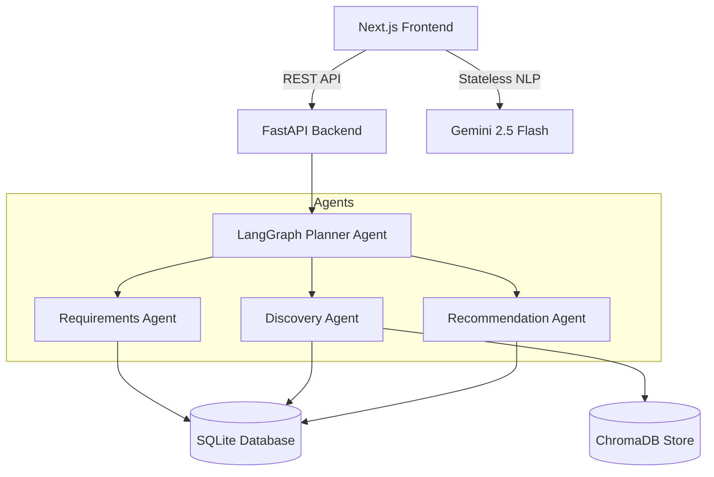
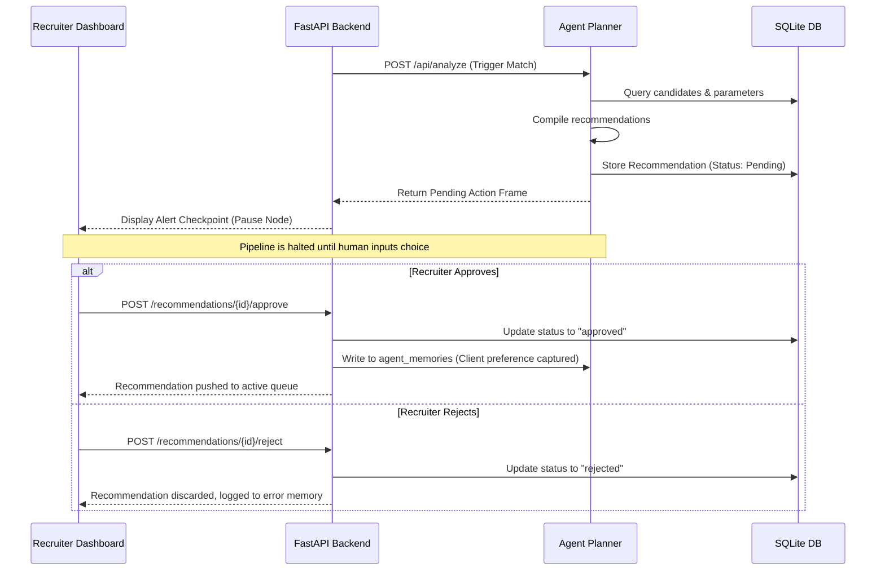
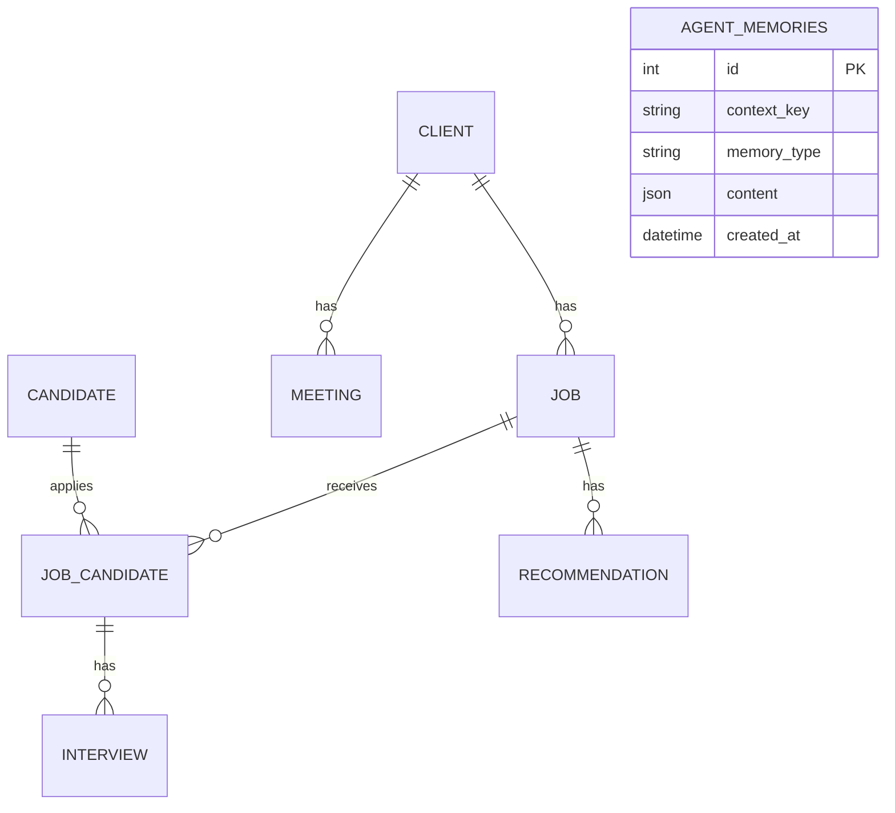

# TalentFlow AI Architecture & Design Decisions

This document outlines the high-level architecture, design decisions, database schemas, and sequence flows that govern the **TalentFlow AI** platform.

---

## 1. High-Level Architecture Diagram

---

## 2. Key Design Decisions

The development of TalentFlow AI is governed by six key architectural decisions, optimizing for speed, safety, and transparency.

### Decision 1: Hybrid NLP Pipeline (Stateless Gemini + Stateful LangGraph)
- **Design**: The stateless meeting transcript ingestion is performed on the frontend via a Next.js server route invoking **Gemini 2.5 Flash**, while stateful candidate discovery and workflow planning are orchestrated by **LangGraph** on the FastAPI backend.
- **Rationale**: Direct transcript parsing is a stateless NLP task requiring low latency, which is best served by Gemini 2.5 Flash's JSON-response capabilities. The candidate search pipeline requires access to relational state databases, matching logic, and workflow steps, which are best managed by LangGraph's state machine.

### Decision 2: Human-in-the-Loop (HTL) as a Stateful Constraint
- **Design**: The LangGraph state machine enforces a strict boundary checkpoint at the `Human Approval` node. The pipeline cannot transition to `END` until explicit action (Approve/Reject) is registered.
- **Rationale**: In high-stakes recruiting, raw AI generation can lead to security, compliance, or salary mismatches. The HTL checkpoint guarantees that no data is committed to the main dashboard action queue without human validation.

### Decision 3: Four-Tier Memory Framework
- **Design**: We implement a segmented memory hierarchy:
  1. *Session memory* (`sessionStorage`) for zero-friction client-side demo handoffs.
  2. *Recruiter memory* (`localStorage`) for temporary in-app state modifications.
  3. *Relational client memory* (`agent_memories` SQL table) for persistent, key-value client preferences.
  4. *Vector memory* (`ChromaDB`) for semantic resume indexing.
- **Rationale**: Isolating memory tiers prevents network bottlenecks for temporary UI states while preserving deep learning parameters for persistent client preference indexing.

### Decision 4: Transparent Explainability UI
- **Design**: Recruiters are presented with a slide-out `ExplainabilityDrawer` showing the reasoning behind every recommendation card:
  - *Confidence bar*: Displays mathematical certainty.
  - *Retrieved Evidence*: Shows the exact meeting transcript quote that triggered the recommendation.
  - *Alternatives*: Outlines what other choices the agent rejected.
  - *Projected Impact*: Outlines quantitative benefits.
- **Rationale**: Recruiters ignore black-box AI outputs. Giving them the full reasoning trail builds user trust and makes the tool audit-safe.

### Decision 5: SQLite Database Fallback
- **Design**: By default, SQLAlchemy links to SQLite (`sqlite:///./talentflow.db`) for local development, with environment variable routing configured for PostgreSQL in production container environments.
- **Rationale**: SQLite provides zero-config local development, enabling the platform to run instantly out-of-the-box, making onboarding and local demonstration frictionless.

---

## 3. Sequence Flow: Human-in-the-Loop Verification

This sequence diagram illustrates how a proposed action transitions through the Human-in-the-Loop checkpoint before finalization:

---

## 4. Database Schema Relationships

The relational data model consists of 6 primary entities linked via SQLAlchemy relationships:

- **`Client`**: Represents hiring client companies.
- **`Job`**: Requisitions detailing requirements and salary bands.
- **`Candidate`**: Standard resume profiles.
- **`JobCandidate`**: The applicant-to-job matching matrix (tracks matching scores and current stage: `sourced`, `screened`, `interviewed`, `offered`, `placed`).
- **`Recommendation`**: Actions queued by the agent awaiting HTL approval.
- **`AgentMemory`**: Persistent memory key-value contexts mapping client/domain rules.
