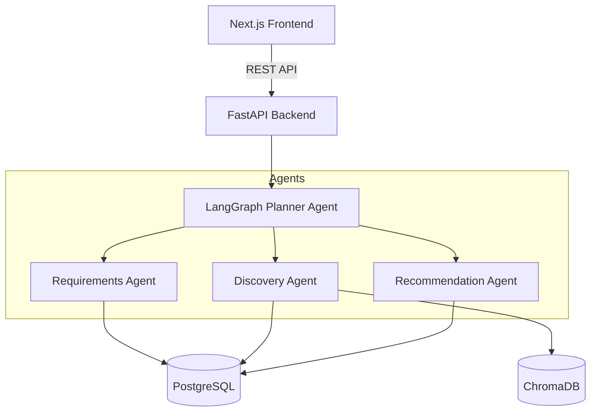
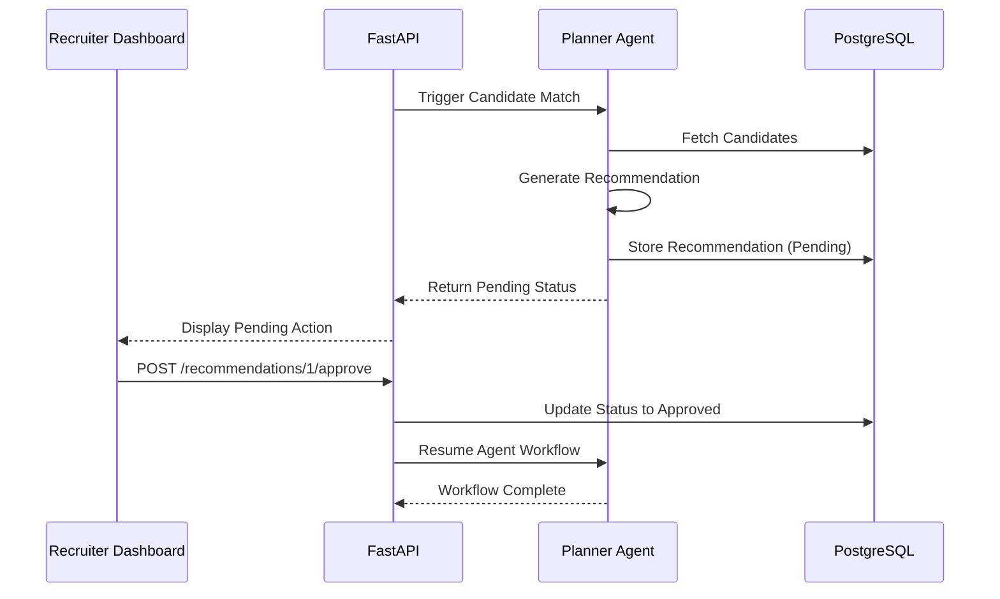
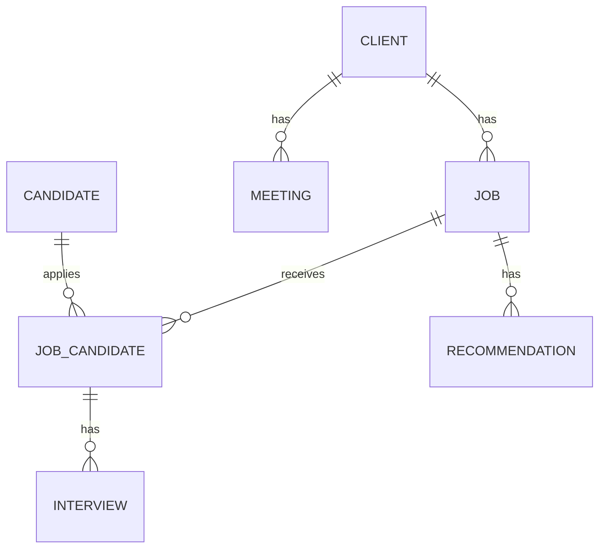

# TalentFlow AI Architecture

## High-Level Architecture Diagram

```mermaid
graph TD
    Client[Next.js Frontend] --> |REST API| API[FastAPI Backend]
    
    API --> Planner[LangGraph Planner Agent]
    
    subgraph Agents
        Planner --> ReqAgent[Requirements Agent]
        Planner --> MatchAgent[Discovery Agent]
        Planner --> RecAgent[Recommendation Agent]
    end
    
    ReqAgent --> DB[(PostgreSQL)]
    MatchAgent --> Chroma[(ChromaDB)]
    MatchAgent --> DB
    RecAgent --> DB
```

## Sequence Diagram: Human-in-the-Loop Recommendation

```mermaid
sequenceDiagram
    participant UI as Recruiter Dashboard
    participant API as FastAPI
    participant LangGraph as Planner Agent
    participant DB as PostgreSQL
    
    API->>LangGraph: Trigger Candidate Match
    LangGraph->>DB: Fetch Candidates
    LangGraph->>LangGraph: Generate Recommendation
    LangGraph->>DB: Store Recommendation (Pending)
    LangGraph-->>API: Return Pending Status
    API-->>UI: Display Pending Action
    
    UI->>API: POST /recommendations/1/approve
    API->>DB: Update Status to Approved
    API->>LangGraph: Resume Agent Workflow
    LangGraph-->>API: Workflow Complete
```

## Database Schema Diagram

```mermaid
erDiagram
    CLIENT ||--o{ JOB : has
    CLIENT ||--o{ MEETING : has
    JOB ||--o{ JOB_CANDIDATE : receives
    JOB ||--o{ RECOMMENDATION : has
    CANDIDATE ||--o{ JOB_CANDIDATE : applies
    JOB_CANDIDATE ||--o{ INTERVIEW : has
```
